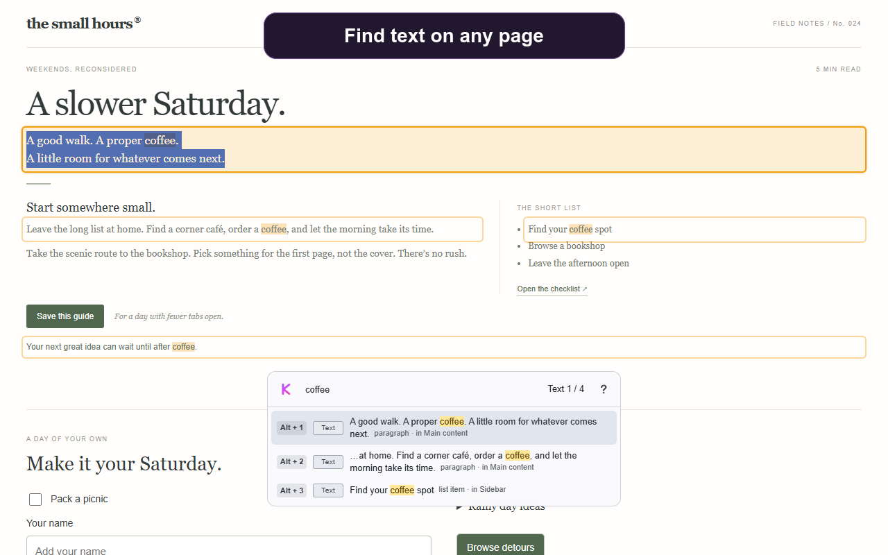

<p align="center">
  
</p>

# KeyMove

Search and navigate web pages without leaving the keyboard. Find visible text and controls,
jump between results, copy a passage, or follow a link as you type.

[Website and interactive demo](https://keymove.minddevops.eu) ·
[Navigation videos](https://keymove.minddevops.eu/patterns.html) ·
[User guide](docs/user-guide.md)

[](https://keymove.minddevops.eu)

> [!IMPORTANT]
> KeyMove is not published in browser extension stores yet. Build and load it locally using
> the instructions below. The Chromium build supports Chrome and Vivaldi; Firefox has its own Manifest V3 build.

## What it does

- Search visible page text, links, buttons, and form controls immediately as you type.
- Recover from typos with approximate matching when no exact results exist.
- Navigate whole text blocks for copying, or actions for clicking and focusing.
- Search eligible iframes, open Shadow DOM components, and active modal dialogs.
- Choose light or dark appearance, position the interface, and set activation per site.
- Process searches locally, with no account, analytics, or remote search service.

## Try it

After loading the extension, open an ordinary web page and press **Alt + F** to focus KeyMove.
Type something visible on the page, then use:

| Shortcut | Action |
| --- | --- |
| Tab / Shift + Tab | Move forward / backward through results. |
| Alt + S | Switch between text and action results. |
| Enter | Activate the selected link or control. |
| Down arrow | Open the selected result's action menu. |
| Ctrl + C | Copy the selected passage or link URL. |
| Escape | Close KeyMove and stay at the current position. |
| Alt + Backspace | Return to where the search began and close KeyMove. |

On macOS, use Option for Alt and Command for copy. Browser and operating-system shortcuts
can take precedence; the opening shortcut is configurable in settings.
See the [full shortcut and settings reference](docs/user-guide.md).

## Install from source

### Requirements

- Node.js `24.15.0` or newer
- Yarn `1.22`

Clone the repository and build both browser targets:

```sh
git clone https://github.com/valentindimitrov/keymove.git
cd keymove
node --version
yarn install --frozen-lockfile
yarn build
```

The build creates:

- `.output/chrome-mv3` for Chrome, Chromium, and Vivaldi
- `.output/firefox-mv3` for Firefox

### Chrome, Chromium, or Vivaldi

1. Open the browser's extension management page. In Vivaldi, use `vivaldi://extensions`.
2. Enable developer mode.
3. Choose **Load unpacked**.
4. Select `.output/chrome-mv3`.

### Firefox

1. Open `about:debugging#/runtime/this-firefox`.
2. Choose **Load Temporary Add-on**.
3. Select `.output/firefox-mv3/manifest.json`.

Temporary Firefox installations are removed when Firefox closes. A permanent Firefox package will
require the release extension ID and normal signing process.

## Privacy and permissions

Search runs locally in your browser. Page access lets KeyMove find text and controls; local
storage holds your settings. Browser-internal pages and extension stores cannot be searched.
Read the [privacy policy](https://keymove.minddevops.eu/privacy-policy.html) or expand the
permission details below.

<details>
<summary>Permission details</summary>

KeyMove processes page content locally in the browser. It has no user account, email sign-in,
telemetry, analytics, or remote search backend.

The extension requests:

- **Site access** so it can search and navigate the pages where it is enabled.
- **Storage** to retain settings and the popup position locally.
- **Scripting** to initialize KeyMove safely in eligible tabs that were already open when the
  extension was installed.

Runtime data from imported configuration, extension storage, browser messages, and browser APIs is
validated before use.

</details>

## Help and contributions

- [Report a reproducible bug](https://github.com/valentindimitrov/keymove/issues/new?template=bug_report.yml).
- [Ask a question](https://github.com/valentindimitrov/keymove/discussions/categories/q-a) or
  [suggest a feature](https://github.com/valentindimitrov/keymove/discussions/categories/ideas).
- Report vulnerabilities privately using [SECURITY.md](SECURITY.md).
- Read [CONTRIBUTING.md](CONTRIBUTING.md), the [development workflow](docs/development.md),
  and the [command and architecture reference](docs/development-reference.md) before opening a pull request.

## License and acknowledgements

KeyMove builds on [YipYip by Comake, Inc.](https://github.com/comake/yip-yip).

Powered by Comake.

Original KeyMove contributions by Valentin Dimitrov use Apache License 2.0. Inherited and
adapted YipYip code retains BSD 4-Clause. Both texts and their scope are in [LICENSE](LICENSE)
and included in browser builds. Upstream relicensing permission has not been obtained;
KeyMove is independently maintained and this acknowledgement does not imply endorsement.

## Support KeyMove

[Optional tips](https://buy.stripe.com/cNi4gAetW99C0Yq9YN5c400) support development and do not
unlock features. Contact: [keymove.impulse550@passmail.com](mailto:keymove.impulse550@passmail.com).
